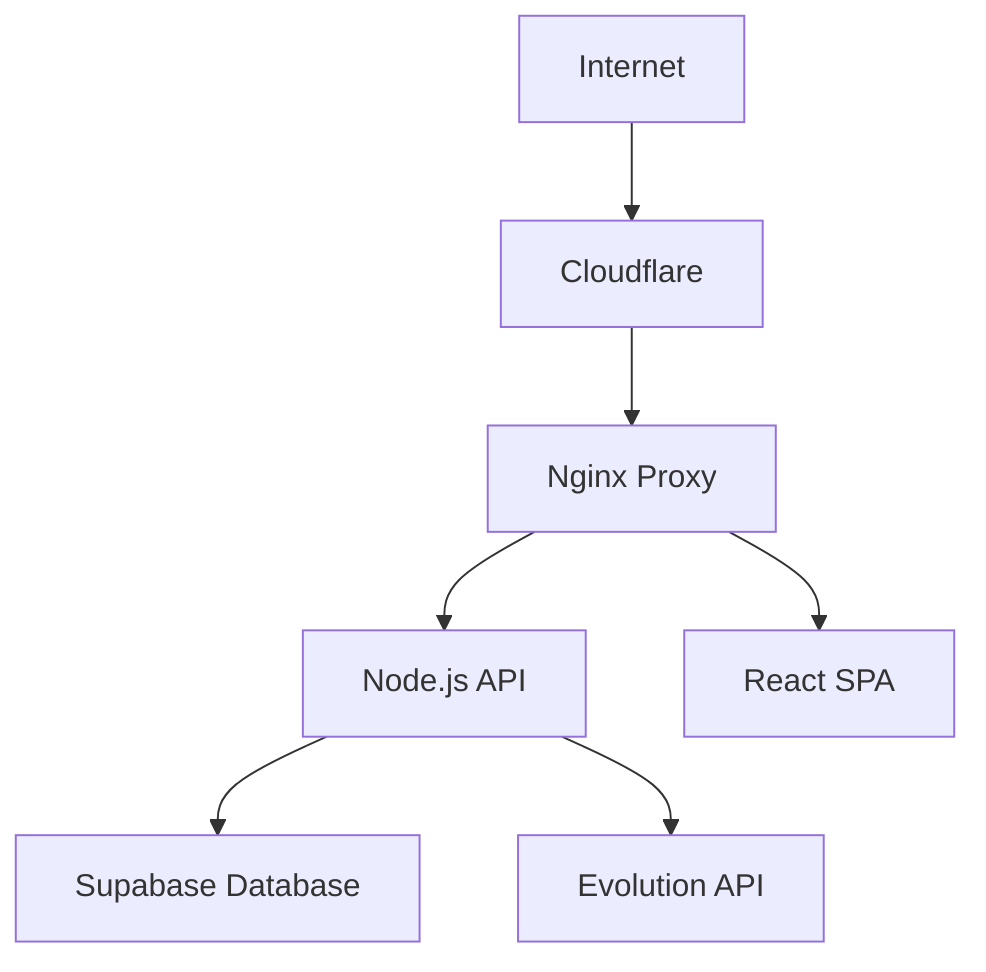

# 🔒 Documentação de Segurança - FgtsAgent

## Índice
- [Visão Geral](#visão-geral)
- [Configurações de Segurança](#configurações-de-segurança)
- [Autenticação e Autorização](#autenticação-e-autorização)
- [Proteção de Dados](#proteção-de-dados)
- [Monitoramento e Logs](#monitoramento-e-logs)
- [Backup e Recuperação](#backup-e-recuperação)
- [Checklist de Segurança](#checklist-de-segurança)

## Visão Geral

Este documento descreve as medidas de segurança implementadas no sistema FgtsAgent e as boas práticas que devem ser seguidas para manter a aplicação segura.

### Arquitetura de Segurança



## Configurações de Segurança

### 1. Headers de Segurança (Nginx)

```nginx
# Strict Transport Security
add_header Strict-Transport-Security "max-age=31536000; includeSubDomains; preload" always;

# Content Security Policy
add_header Content-Security-Policy "default-src 'self'; script-src 'self' 'unsafe-inline' 'unsafe-eval' cdn.jsdelivr.net; style-src 'self' 'unsafe-inline' cdn.jsdelivr.net fonts.googleapis.com; font-src 'self' fonts.gstatic.com cdn.jsdelivr.net; img-src 'self' data: blob: *.supabase.co; connect-src 'self' *.supabase.co wss: *.evolution-api.com; media-src 'self'; object-src 'none'; base-uri 'self'; form-action 'self';" always;

# Anti-clickjacking
add_header X-Frame-Options DENY always;

# MIME type sniffing
add_header X-Content-Type-Options nosniff always;

# XSS Protection
add_header X-XSS-Protection "1; mode=block" always;
```

### 2. SSL/TLS

- **Protocolo**: TLS 1.2 e 1.3 apenas
- **Certificados**: Let's Encrypt com renovação automática
- **HSTS**: Habilitado com preload
- **OCSP Stapling**: Ativo para melhor performance

### 3. Rate Limiting

```javascript
// Limites configurados
const generalLimiter = rateLimit({
  windowMs: 15 * 60 * 1000, // 15 minutos
  max: 300 // 300 requisições por IP
});

const apiLimiter = rateLimit({
  windowMs: 15 * 60 * 1000,
  max: 200 // 200 requisições para APIs
});

const authLimiter = rateLimit({
  windowMs: 15 * 60 * 1000,
  max: 30 // 30 tentativas de autenticação
});
```

## Autenticação e Autorização

### 1. Autenticação Supabase

- **JWT Tokens**: Tokens seguros com expiração
- **OAuth2**: Google OAuth implementado
- **MFA**: Suporte a autenticação multi-fator (via Supabase)
- **Session Management**: Gerenciamento seguro de sessões

### 2. Autorização por Níveis

```javascript
// Níveis de acesso
const ROLES = {
  USER: 'user',           // Usuário padrão
  MODERATOR: 'moderator', // Moderador
  ADMIN: 'admin'          // Administrador
};

// Middleware de autorização
const requireRole = (role) => {
  return (req, res, next) => {
    if (!req.user || !hasRole(req.user, role)) {
      return res.status(403).json({ 
        error: 'Acesso negado' 
      });
    }
    next();
  };
};
```

### 3. Proteção de Rotas

- **Middleware de autenticação**: Verificação em todas as rotas protegidas
- **Validação de tokens**: JWT validado em cada requisição
- **Refresh tokens**: Implementado para sessões longas

## Proteção de Dados

### 1. Sanitização de Entrada

```javascript
// XSS Protection
const xssOptions = {
  whiteList: {
    p: [], br: [], strong: [], em: []
  },
  stripIgnoreTag: true,
  stripIgnoreTagBody: ['script', 'style']
};

// Validação com Joi
const schemas = {
  email: Joi.string().email().required(),
  password: Joi.string()
    .min(8)
    .pattern(/^(?=.*[a-z])(?=.*[A-Z])(?=.*\d)(?=.*[@$!%*?&])/)
    .required()
};
```

### 2. Criptografia

- **Senhas**: Hashing com bcrypt (cost factor 12)
- **Dados sensíveis**: AES-256 para dados em repouso
- **Comunicação**: TLS 1.3 para dados em trânsito
- **Tokens**: JWT com assinatura HMAC SHA-256

### 3. Validação de CPF

```javascript
function isValidCPF(cpf) {
  // Implementação completa de validação
  // Remove caracteres não numéricos
  // Verifica dígitos verificadores
  // Rejeita sequências inválidas
}
```

## Monitoramento e Logs

### 1. Logging Avançado

```javascript
// Estrutura de logs
const logData = {
  requestId: crypto.randomBytes(8).toString('hex'),
  timestamp: new Date().toISOString(),
  method: req.method,
  url: req.url,
  ip: req.ip,
  userAgent: req.get('User-Agent'),
  responseTime: duration,
  status: res.statusCode
};

// Detecção de atividade suspeita
function detectSuspiciousActivity(ip, userAgent, url) {
  // Analisa padrões de requisições
  // Detecta força bruta
  // Monitora tentativas de exploração
}
```

### 2. Health Checks

- **Basic**: `/health` - Verificação rápida
- **Detailed**: `/health/detailed` - Verificação completa
- **Ready**: `/health/ready` - Readiness probe
- **Live**: `/health/live` - Liveness probe
- **Metrics**: `/health/metrics` - Métricas Prometheus

### 3. Alertas

- **Falhas de autenticação**: Alerta após 5 tentativas
- **Erro 500**: Notificação imediata
- **Alta latência**: Alerta se > 5 segundos
- **Uso de recursos**: Monitoramento CPU/Memória

## Backup e Recuperação

### 1. Estratégia de Backup

```bash
# Backup automático diário
0 3 * * * /scripts/backup.sh

# Retenção: 30 dias
# Verificação de integridade: SHA256
# Notificação por webhook
```

### 2. Dados Protegidos

- **Logs da aplicação**: Rotação e backup
- **Uploads de usuários**: Backup incremental
- **Configurações SSL**: Backup dos certificados
- **Dados do banco**: Backup via Supabase

### 3. Recuperação

- **RTO**: 4 horas (Recovery Time Objective)
- **RPO**: 24 horas (Recovery Point Objective)
- **Testes**: Mensais de recuperação

## Checklist de Segurança

### ✅ Infraestrutura

- [ ] Firewall configurado
- [ ] Portas desnecessárias fechadas
- [ ] Updates automáticos ativados
- [ ] Monitoramento de intrusão
- [ ] Backup funcionando
- [ ] SSL/TLS atualizado

### ✅ Aplicação

- [ ] Dependências atualizadas
- [ ] Secrets em variáveis de ambiente
- [ ] Rate limiting ativo
- [ ] Logging configurado
- [ ] Validação de entrada
- [ ] Headers de segurança

### ✅ Banco de Dados

- [ ] Acesso restrito
- [ ] Criptografia em repouso
- [ ] Backup regular
- [ ] Audit log ativo
- [ ] Conexão SSL apenas
- [ ] Usuários com privilégios mínimos

### ✅ Autenticação

- [ ] Senhas fortes obrigatórias
- [ ] MFA disponível
- [ ] Sessões com timeout
- [ ] Logout seguro
- [ ] Tokens com expiração
- [ ] OAuth2 configurado

## Incidentes de Segurança

### Procedimento

1. **Detecção**: Logs/alertas automáticos
2. **Contenção**: Isolar o problema
3. **Investigação**: Analisar logs e causa raiz
4. **Correção**: Aplicar patches/fixes
5. **Documentação**: Registrar lições aprendidas

### Contatos

- **Responsável Técnico**: [email]
- **Equipe DevOps**: [email]
- **Gerência**: [email]

### Ferramentas

- **Logs**: Winston + Supabase
- **Monitoramento**: Health checks + webhooks
- **Alertas**: Webhook notifications
- **Backup**: Scripts automatizados

## Compliance e Regulamentações

### LGPD (Lei Geral de Proteção de Dados)

- **Minimização**: Coleta apenas dados necessários
- **Finalidade**: Uso específico e informado
- **Transparência**: Política de privacidade clara
- **Segurança**: Medidas técnicas adequadas
- **Direitos**: Portabilidade, exclusão, correção

### Boas Práticas

- **Criptografia**: Dados sensíveis sempre criptografados
- **Acesso**: Princípio do menor privilégio
- **Auditoria**: Logs de todas as operações
- **Retenção**: Políticas claras de retenção
- **Breach**: Procedimentos de notificação

---

**Última atualização**: $(date)
**Versão**: 1.0
**Responsável**: Equipe de Desenvolvimento FgtsAgent 